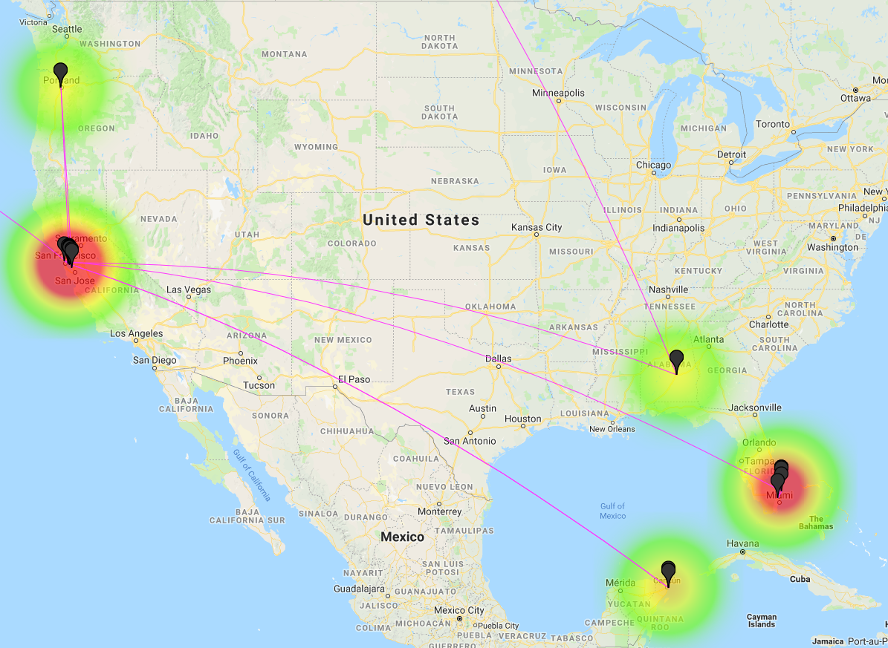

# untappdScraper

I noticed that many people on Twitter [publish when they use the Untappd.com](https://www.google.com/search?num=100&newwindow=1&q=untappd+%22i+just+earned%22+site%3Atwitter.com&oq=untappd+%22i+just+earned%22+site%3Atwitter.com&gs_l=serp.3...4164.7850.0.8239.9.9.0.0.0.0.140.679.6j2.8.0....0...1c.1.64.serp..1.3.259...33i160k1j33i21k1.7lDTNQbSBAk) application. This app allows a user to "check-in" when they drink beer. They get badges, they dates and times of their drinking is noted, and many times the geographic location of where they drank is also available.....all with no authentication! Woohoo!

So I wondered if I could patch together some Python to scrape the [Untappd.com](http://untappd.com) web site for a given user and then do some analytics on their drinking habits. Stuff like:

* What time of day do they drink most often?
* What day of the week do they drink most often?
* What day of the month do they drink most often?
* Who do they drink with?
* Where do they drink?
* Are they "binge" drinking?

The output from this (shown below), is output to the terminal/command line. One exception is that the GPS locations of all the places the user account reported consuming drinks at are written to an HTML output file in the current directory. You can double click on the HTML file and see a heat map of all the places that the person recorded drinking at. Could you infer where they worked and lived from this data? I'll let you guess.

## Caveats

Since this script scrapes the public pages:

* Private Untappd profiles are not scraped
* Without using the Untappd API and without requiring login, it only has access to the last 25 beers a target has consumed. While this doesn't sound like a lot, we can learn many things from 25 beers. And what if you ran this script every week (or day!)? Could you store all the data about a specific person on a rolling basis? Yup!

## Usage

### Requirements

The most important requirement is __this script is written in Python 3.x__.

#### Modules

* bs4
* geocoder
* gmplot
* googlemaps
* requests

If you have PIP installed, type: `pip3 install -r requirements.txt` from the command line and your system should install all required modules.

#### Geocoding API

You will need to add your Google and/or Bing API keys to the `geocode_api_keys.py` file by replacing the following content:

```bash
google_api_key = 'YOUR_GOOGLE_API_KEY'
bing_api_key = 'YOUR_BING_API_KEY'
```

Of course this means you need to go get a valid Google Developer API key for the Geocoding
(<https://developers.google.com/>).

You also can also create a Bing API key for free at <https://www.bingmapsportal.com/>. 

## Help command Output

```bash
$  python3 untappd.py -h
usage: untappd.py [-h] -u USER

Grab untappd user activity

optional arguments:
  -h, --help            show this help message and exit
  -u USER, --user USER  Username to research
```

## Example Output

```bash
$ python untappd.py -u nvrhapy

[ ] USER DATA: Requesting https://untappd.com/user/nvrhapy

        Total Beers:    2,454
        Total Unique:   1,217
        Total Badges:     569
        Total Friends:     16

[ ] FRIEND DATA: Requesting 25 friends from https://untappd.com/user/nvrhapy/friends

              Account               Name              Location
        -------------------- ------------------ --------------------
        yeoldstinkeye        Tight Lips Jimmy   Chicago
        Supah_Set            Joshua B.
        tommasocamilleri2    Tommaso C.         Chicago Heights, Illinois
        Joeheredia           Joe H.
        beerhere89           stephany d.
        Jwilson126           Jason W.
        fernicus             Adam F.
        1MattyG              Matty G.           Arlington Heights, IL
        traceyann83          Tracey N.
        Fatabird             Fatima F.
        greencape            Jay M.
        crispix              Christina Z.
        Redpac               Dan S.             New Lenox, IL
        pinatax              Tall S.            Chicago
        sprout1880           russell u.         chicago hieghts
        1rar3br33d           Matt

[ ] BEER CONSUMPTION DATA: Requesting https://untappd.com/user/nvrhapy/beers
[*]  Drinking Patterns (Last 25 beers) - Days of Week
         Day ( #) : HISTOGRAM
        ---------------------------------
         Mon ( 0) :
         Tue ( 0) :
         Wed ( 5) : xxxxx
         Thu ( 3) : xxx
         Fri ( 3) : xxx
         Sat ( 6) : xxxxxx
         Sun (11) : xxxxxxxxxxx

[*]  Drinking Patterns (Last 25 beers) - Hours of Day
         Hour  ( #) : HISTOGRAM
      ---------------------------------
         06:00 ( 0) :
         07:00 ( 0) :
         08:00 ( 0) :
         09:00 ( 0) :
         10:00 ( 0) :
         11:00 ( 0) :
         12:00 ( 1) : x
         13:00 ( 0) :
         14:00 ( 5) : xxxxx
         15:00 ( 2) : xx
         16:00 ( 1) : x
         17:00 ( 5) : xxxxx
         18:00 ( 3) : xxx
         19:00 ( 6) : xxxxxx
         20:00 ( 1) : x
         21:00 ( 1) : x
         22:00 ( 1) : x
         23:00 ( 1) : x
         00:00 ( 1) : x
         01:00 ( 0) :
         02:00 ( 0) :
         03:00 ( 0) :
         04:00 ( 0) :
         05:00 ( 0) :

[*]  Drinking Patterns (Last 25 beers) - Day of Month
       Day (#) : HISTOGRAM
      ---------------------------------
       00  ( 0) :
       01  ( 0) :
       02  ( 1) : x
       03  ( 0) :
       04  ( 2) : xx
       05  ( 0) :
       06  ( 1) : x
       07  ( 1) : x
       08  ( 0) :
       09  ( 0) :
       10  ( 0) :
       11  ( 1) : x
       12  ( 0) :
       13  ( 4) : xxxx
       14  ( 0) :
       15  ( 0) :
       16  ( 0) :
       17  ( 0) :
       18  ( 0) :
       19  ( 5) : xxxxx
       20  ( 1) : x
       21  ( 0) :
       22  ( 4) : xxxx
       23  ( 1) : x
       24  ( 0) :
       25  ( 1) : x
       26  ( 4) : xxxx
       27  ( 1) : x
       28  ( 0) :
       29  ( 0) :
       30  ( 0) :
       31  ( 1) : x

[!] *ALERT - Due to drinking 5 beers on day 19, user may be a "Binge Drinker"
[!]          Examine times they drank the beers below. If 5+ drinks in < 2 hours, then binge.
[!]            14:47:53
[!]            16:22:59
[!]            17:38:35
[!]            18:09:01
[!]            20:10:21
[!]      * This script does not examine the amount of time between drinks, which is important.
[!]      * https://www.niaaa.nih.gov/alcohol-health/overview-alcohol-consumption/moderate-binge-drinking

[ ] VENUE DATA: Requesting https://untappd.com/user/nvrhapy/venues?type=&sort=highest_checkin

      Checkins   Name, Address (Geocode)
      --------  ----------------------------------------------------
         633      shorts house, IL  (39.3566722, -88.4601469)
         304      steve and christinas, IL  (40.6331249, -89.3985283)
         108      Redpac's Cocktail Lounge and Beer Bar, 2145 calistoga ave New Lenox, IL  (41.48105899999999, -87.9570718)
          57      sprout's brew haus, IL  (39.8018003, -89.64711720000001)
          42      The Beer Dungeon, IL  (42.1857372, -88.4369487)
          40      Evil Horse Brewing Company, 1338 Main St Crete, IL  (41.444957, -87.631468)
          37      halsted & joe orr rd, IL  (41.5207079, -87.6356019)
          35      Peaceful Acres Resort, Larch Rd Ludington, MI  (44.0051131, -86.46920539999999)
          32      Steger Wildcat Football, IL  (41.4700348, -87.636432)
          31      One Trick Pony, 17933 Chappel Ave Lansing, IL  (41.5711478, -87.571823)
          26      Flossmoor Station Restaurant & Brewery, 1035 Sterling Ave Flossmoor, IL  (41.5433753, -87.6786252)
          24      Road America, N7390 State Road 67 Elkhart Lake, WI  (43.80450510000001, -87.9868194)
          24      Lassen's Sports Bar & Grill, 2131 183rd St Homewood, IL  (41.5570125, -87.6689267)
          23      Chicagoland Speedway, 500 Speedway Blvd Joliet, IL  (41.4749519, -88.0573003)
          22      Smokey Jo's Scratch Kitchen & Ale House, 475 W Burville Rd Crete, IL  (41.435353, -87.6304124)
          18      MountainLoft Resort, 110 Mountainloft Dr Gatlinburg, TN  (35.7306579, -83.4827645)
          17      Rock Bottom - Orland Park, 16156 South La Grange Road Orland Park, IL  (41.5960194, -87.8531833)
          17      Matts place, IL  (42.244263, -88.316465)
          17      Steger Baseball (Veterans Park), 3599 Phillips Ave Steger, IL  (41.4660376, -87.6304869)
          16      Crown Brewing, 211 S East St Crown Point, IN  (41.4158226, -87.36357629999999)
          15      Northwoods Restaurant & Saloon, 968 E Steger Rd Crete, IL  (41.46951079999999, -87.5885505)
          14      Richard D. Irwin Park, IL  (41.56096290000001, -87.6621203)
          13      The Open Bottle, 7101 183rd St, Unit 105 Tinley Park, IL  (41.5580442, -87.79042849999999)
          13      City of Chicago Heights, IL  (41.502062, -87.6399599)
          12      Eastview School, IL  (42.1572088, -88.2829004)

[ ] HTML output file named untappd_map_nvrhapy_1557162596.html was written to disk.
```

All scripts (with a valid Google/Bing API key) should produce HTML output files that show the geolocated content. An example is below:


If your web page shows "For Development Purposes Only" watermarks, you will need to edit the HTML file and add your Google API key for JavaScript Maps API. Add `key=YOUR_GOOGLE_API_KEY` to the end of the maps.googleapis.com line like this: `https://maps.googleapis.com/maps/api/js?libraries=visualization&sensor=true_or_false&key=YOUR_GOOGLE_API_KEY`

## To Do

* Webify this so that it looks better and easy to access
* Use an internal DB (sqlite?) to track users over time
* Colorize output

## License

<a rel="license" href="http://creativecommons.org/licenses/by-sa/4.0/"></a><br />This work is licensed under a <a rel="license" href="http://creativecommons.org/licenses/by-sa/4.0/">Creative Commons Attribution-ShareAlike 4.0 International License</a>.
